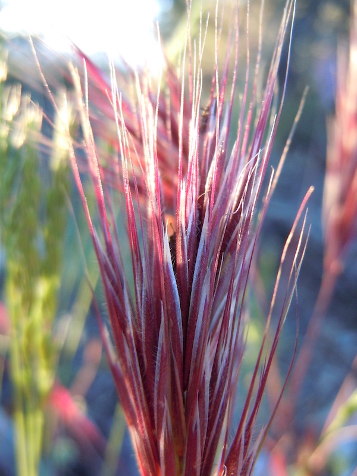

## Native-brome competition trials

<br>

### Purpose

To explore the importance of brome invasion and drought on annual plant species germination, mortality and biomass in the San Joaquin Desert.

<br> 

```{r}
library(dplyr)
library(tidyr)
library(ggplot2)
library(readr)
library(performance)
library(emmeans)
library(gridExtra)

data <- read_csv("data/data.csv")

data <- data %>% rename(native.seed = native.density, brome.seed = brome.density, brome.plant = brome)
data <- mutate(data, native.plant = ifelse(native.species == "Plantago insularis", plantago, ifelse(native.species == "Salvia columbariae", salvia, phacelia)))
data <- mutate(data, mixture = ifelse(brome.seed == 0, "nobrome", "brome"))
```

## Establishment - Annuals

```{r, establishment}
est <- data %>%
  filter(census == 2)

ggplot(est, aes(native.species, native.plant, color = mixture, fill = as.factor(water.treatment))) + geom_boxplot()
ggplot(est, aes(water.treatment, native.plant, color = mixture)) + geom_smooth(method = "lm") + facet_grid(~native.species)
ggplot(est, aes(brome.plant, native.plant, color = as.factor(water.treatment))) + geom_smooth(method = "lm") + facet_grid(~native.species)

str(est)
m4 <- glm(native.plant ~ native.species * mixture * water.treatment, data = est, family = poisson)
summary(m4)
car::Anova(m4, test = "LR")
knitr::kable(car::Anova(m4, type = 2, test.statistic="LR"))
check_overdispersion(m4)

a <- emmeans(m4, list(pairwise ~ native.species*mixture), adjust = "tukey")
a <- summary(a)
b <- a$`pairwise differences of native.species, mixture`
write.csv(b, "data/estmodelcontrasts.csv")
lstrends(m4, ~native.species, var = "water.treatment")

```

## Establishment - Brome

```{r}
brome.est <- filter(est, mixture == "brome")
brom2 <- glm(brome.plant ~ water.treatment * native.species, data = brome.est, family = poisson)

check_overdispersion(brom2)
summary(brom2)

knitr::kable(car::Anova(brom2))
emmeans(brom2, list(pairwise ~ native.species), adjust = "tukey")

```

## Survivorship - Annuals

```{r, survive}

sur <- data %>%
  filter(census == 3)

ggplot(sur, aes(water.treatment, native.plant, color = mixture)) + geom_smooth(method = "lm") + facet_grid(~native.species)

m3 <- glm(native.plant ~ water.treatment*native.species* mixture, data = sur, family = poisson)
check_overdispersion(m3)
summary(m3)
knitr::kable(anova(m3, test = "Chisq"))


sur.em <- emmeans(m3, list(pairwise ~ native.species*mixture), adjust = "tukey")

sur.em
b <- sur.em$`pairwise differences of native.species, mixture`

lstrends(m3, ~native.species, var = "water.treatment")

```

## Survivorship - Brome

```{r}

brome.sur <- filter(sur, mixture == "brome")
brom1 <- glm(brome.plant ~ water.treatment * native.species, data = brome.sur, family = poisson)

check_overdispersion(brom1)
summary(brom1)

knitr::kable(car::Anova(brom1))
emmeans(brom1, list(pairwise ~ native.species), adjust = "tukey")


```

## Biomass - Annuals

```{r, biomass}
prod <- read_csv("data/productivity.csv")
prod <- prod %>% rename(native.biomass = final.native.aboveground.biomass)
prod <- select(prod,1, 7:14)
sur <- left_join(sur, prod, by = "pot.label")
#filter out pots with no biomass
native.prod <- filter(sur, native.biomass > 0)
native.prod <- mutate(native.prod, per.capita = native.biomass/native.plant)

ggplot(native.prod, aes(water.treatment, per.capita, color = mixture)) + geom_smooth(method = "lm") + facet_grid(~native.species)
ggplot(native.prod, aes(per.capita)) + geom_density()


m2 <- glm(per.capita ~ native.species * water.treatment * mixture, data = native.prod, family = Gamma(link = "log"))
plot(m2)
#AIC(m1, m2)
summary(m2)
knitr::kable(car::Anova(m2))


a <- emmeans(m2, list(pairwise ~ native.species*mixture), adjust = "tukey")
a <- summary(a)
options(scipen = 999)
b <- a$`pairwise differences of native.species, mixture`
b


emtrends(m2, pairwise~native.species, var = "water.treatment")

emtrends(m2, ~native.species, var = "water.treatment")

emmip(m2, native.species ~ water.treatment, cov.reduce = range)
```

## Biomass - Brome

```{r, brome}

prod <- rename(prod, final.brome = final.brome.aboveground.biomass)
brome.prod <- left_join(sur, prod, by = "pot.label")
brome.prod <- mutate(brome.prod, brome.per.capita = final.brome/brome.plant)
brome.prod <- filter(brome.prod, brome.per.capita > 0)

m1.ad <- glm(brome.per.capita ~ water.treatment * native.species, data = brome.prod, family = Gamma(link = "log"))
summary(m1.ad)
knitr::kable(car::Anova(m1.ad))
emtrends(m1.ad, ~native.species, var = "water.treatment")

emmeans(m1.ad, list(pairwise ~ native.species), adjust = "tukey")
a <- summary(m1.ad)
b <- a$`pairwise differences of native.species, mixture`


ggplot(brome.prod, aes(water.treatment, brome.per.capita, color = native.species)) + geom_smooth(method = "lm") 

ggplot(brome.prod, aes(water.treatment, final.brome)) + geom_smooth(method = "lm")


```

```{r}

#Figure 1

#establishment - plant count at census 2
a <- ggplot(est, aes(water.treatment, native.plant, color = mixture)) + geom_smooth(method = "lm") + facet_grid(~native.species) + ylab("Establishment") +xlab("")  + theme(panel.grid.major = element_blank(), panel.grid.minor = element_blank(),
panel.background = element_blank(), axis.line = element_line(colour = "black")) +  theme(legend.title = element_blank()) + scale_color_discrete(labels = c("No Brome", "With Brome")) + theme(legend.box = "horizontal", legend.position = c(0.9, 0.7), legend.title = element_blank()) + theme(
  strip.background = element_rect(
     color="black", fill="white", size=.75, linetype="solid"
     ))
        
a

#survival - plant count at census 3
b <- ggplot(sur, aes(water.treatment, native.plant, color = mixture)) + geom_smooth(method = "lm") + facet_grid(~native.species) + ylab("Survival") +xlab("")  + theme(panel.grid.major = element_blank(), panel.grid.minor = element_blank(),
panel.background = element_blank(), axis.line = element_line(colour = "black")) +  theme(legend.position = "none", legend.title = element_blank()) + scale_color_discrete(labels = c("No Brome", "With Brome")) + 
theme(strip.background = element_blank(), strip.text = element_blank())
b

#biomass
c <- ggplot(native.prod, aes(water.treatment, native.biomass, color = mixture)) + geom_smooth(method = "lm") + facet_grid(~native.species) + ylab("Per capita biomass (g)") +xlab("Water Treatment (ml)")  + theme(panel.grid.major = element_blank(), panel.grid.minor = element_blank(),
panel.background = element_blank(), axis.line = element_line(colour = "black")) +  theme(legend.position = "none", legend.title = element_blank()) + scale_color_discrete(labels = c("No Brome", "With Brome")) + 
theme(strip.background = element_blank(), strip.text = element_blank())
c

#l1 <- get_legend(c)

grid.arrange(a, b, c, ncol = 1)

plots <- list(a,b,c)
grobs <- list()
widths <- list()

for (i in 1:length(plots)){
    grobs[[i]] <- ggplotGrob(plots[[i]])
    widths[[i]] <- grobs[[i]]$widths[2:5]
}

maxwidth <- do.call(grid::unit.pmax, widths)
for (i in 1:length(grobs)){
     grobs[[i]]$widths[2:5] <- as.list(maxwidth)
}

p <- do.call("grid.arrange", c(grobs, ncol = 1))
p


```

Supplemental figure

```{r, soil moisture}


#test for significant correlation between moisture and treatment
cor.test(sur$soil.moisture, sur$water.treatment)

ggplot(sur, aes(as.factor(water.treatment), soil.moisture)) + geom_boxplot() + ylab("Volumetric water content (% volume)") + xlab("Water Treatment (ml)") + theme(panel.grid.major = element_blank(), panel.grid.minor = element_blank(),
panel.background = element_blank(), axis.line = element_line(colour = "black")) 


m1 <- aov(soil.moisture ~ as.factor(water.treatment), dat = sur)
summary(m1)
TukeyHSD(m1)

m2 <- lm(soil.moisture ~ water.treatment, data = sur)
summary(m2)

```

```{r, tables}

#establishment
# options(scipen = 999)
# #est.tab <- car::Anova(est.mod, type = 1, test.statistic="F")
# anova(est.mod, test = "Chisq")
# est.tab <- anova(est.mod, test = "Chisq")
# est.tab <- signif(est.tab, digits = 2)
# est.tab <- rename(est.tab, p = "Pr(>Chi)", Chisq = "Deviance")
# est.tab <- mutate(est.tab, p = ifelse(p < 0.001, "< 0.001", signif(p, digits = 2)))
#est.tab <- est.tab %>% select(-"Sum Sq") 
#est.tab <- est.tab[, c(2,1,3)]
#est.tab


#save objects for knitr for export to word
#save(an, file = "out.rda")

```

## RII

Let's look at the relative effect of Brome

{r}

c1 <- filter(sur, mixture == "brome")


rii <- function(data, y)
{
  # Parse out shrub and open
  s1 <- subset(data, mixture == "brome", select=y)
  o1 <- subset(data, mixture == "nobrome", select=y)
  # Rii formula
  return1 <- (s1 - o1) / (s1 + o1)
}


sur_rii <- rii(sur, "native.plant")
sur_rii <- rename(sur_rii, sur.rii = native.plant)
c1 <- cbind(c1, sur_rii)
c1_noNA <- filter(c1, sur.rii != "NaN")


t.test(c1_noNA$sur.rii)
a1 <- lm(sur.rii ~  native.species+water.treatment, data = c1_noNA)
summary(a1)

library(boot)
bootmean <- function(d, i) mean(d[i])
sal_rii <- filter(c1_noNA, native.species == "Salvia columbariae")

SUR.rii <- boot(sal_rii$sur.rii, bootmean, R=10000, stype = "i")
ci.SUR.rii <- boot.ci(SUR.rii)
bca.SUR <- ci.SUR.rii$bca

est_rii <- rii(est, "native.plant")
est_rii <- rename(est_rii, est.rii = native.plant)
c1 <- cbind(c1, est_rii)
#t.test(c1$sest.rii)
a1 <- lm(est.rii ~ as.factor(water.treatment), data = c1)
summary(a1)

ggplot(c1, aes(est.rii, as.factor(water.treatment))) + geom_boxplot()


prod <- mutate(prod, per.capita = native.biomass/native.plant)
sur <- mutate(sur, per.capita = native.biomass/native.plant)


bio_rii <- rii(sur, "per.capita")
bio_rii <- rename(bio_rii, bio.rii = per.capita)
c1 <- cbind(c1, bio_rii)
#t.test(c1$bio.rii)
a1 <- aov(bio.rii ~ native.species, data = c1)
TukeyHSD(a1)
summary(a1) 
nat <- emmeans(a1, "native.species")
pairs(nat)

ggplot(c1, aes(bio.rii, water.treatment)) + geom_smooth(method = "lm")


sal_rii <- filter(c1, native.species == "Salvia columbariae")


#BIO.rii <- boot(sal_rii$bio.rii, bootmean, R=10000, stype = "i")
#ci.SUR.rii <- boot.ci(SUR.rii)
#bca.SUR <- ci.SUR.rii$bca

```
